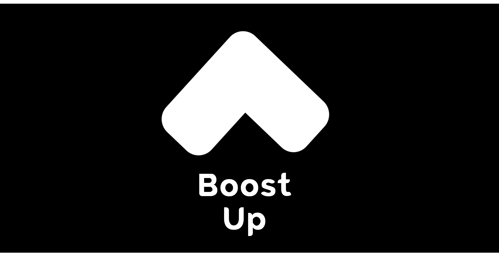

# Boost Up App

•	It is a mobile app for Android, that aims to boost the target user up by allowing the user to explore many motivational quotes✨.

## :scroll: Description

### Libraries and technologies used:
•	Jetpack libraries (Coroutines, Lifecycle, Navigation, WorkManager, and DataBinding).\
•	Junit4.\
•	Retrofit .\
•	Firebase Authentication.\
•	Cloud Firestore.
•	[QuotableAPI](https://github.com/lukePeavey/quotable) 

 
### Demo account:
•	Email: mahila@gmail.com.\
•	Password: Mahila1* .

### SRS of [Bosst Up](https://docs.google.com/document/d/1xF_MbsooJ3ZabX1bLwrxRIHnb96w84Iy/edit)
### Trello of [Bosst Up](https://trello.com/b/ayhTI3mT/motivational-quotes-app)
### Prototype of [Bosst Up](https://www.figma.com/proto/idLGi9AnYq1Xt4UEYEgfJS/Boost-Up-App?node-id=26%3A53&scaling=scale-down&page-id=0%3A1&starting-point-node-id=26%3A53)
 
## :camera_flash: Screenshots
 
  •	Sign in/up screens (Light mode):

  
  
 •	Home screens (Light mode):

  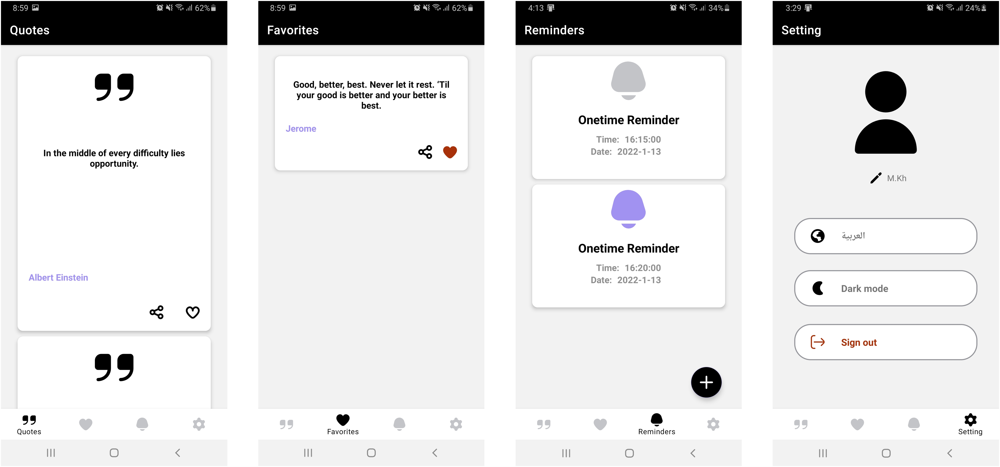
  
 •	Sign in/up screens (Dark mode):
 
  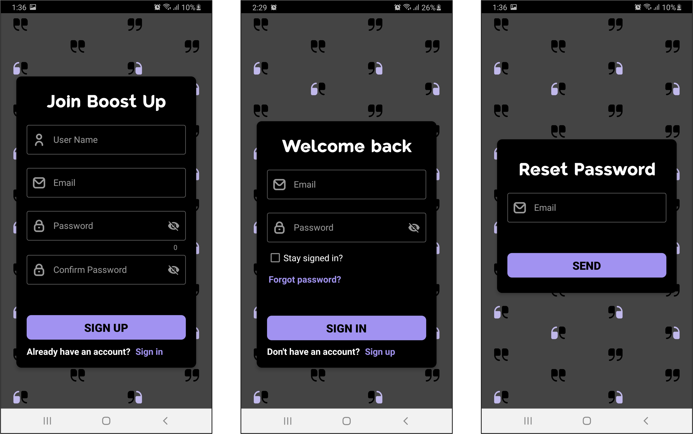

 •	Home screens (Dark mode):

  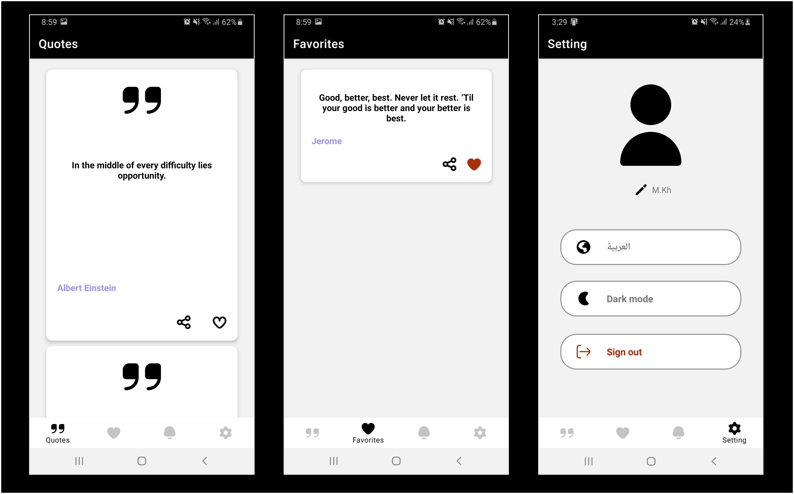
   
 •	Refresh to get new quotes.

 •	Share the quote via other apps.
 
 •	Set reminders at specific times.
 
 •	One click to add/remove the quote to/from favorite list.

 •	One click to deactivate & reactivate the reminder.

 
| 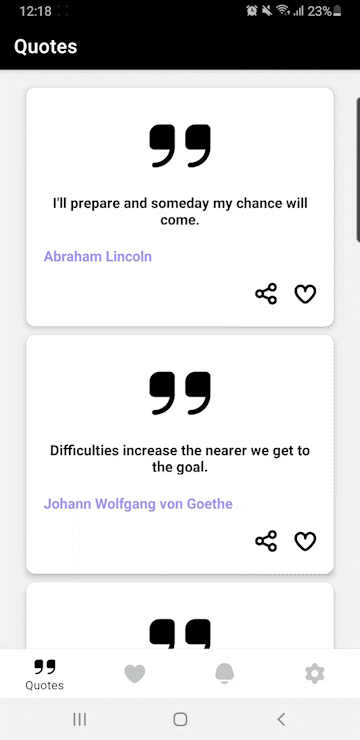|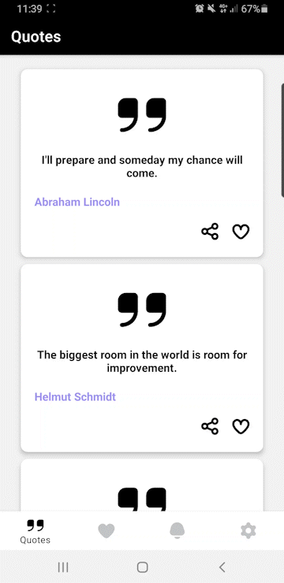|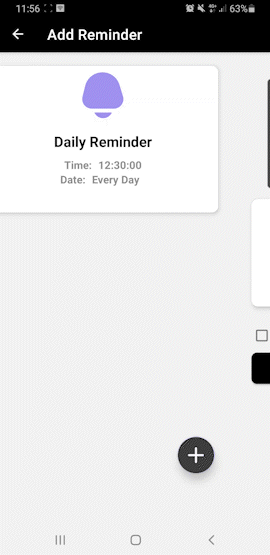|

  

|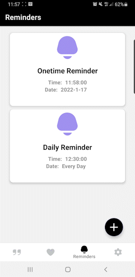||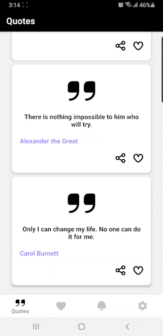|

• One click to undo removing from favorite list.

• One click to	change the mode.

•	One click to change the language.

|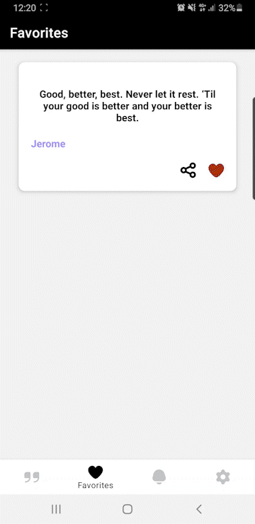|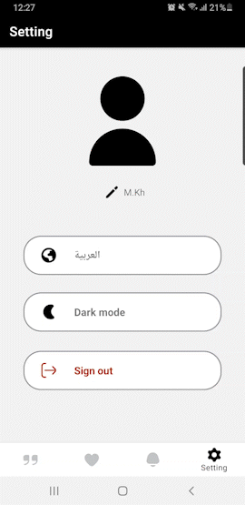|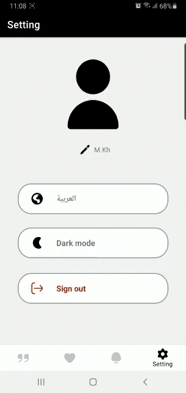
